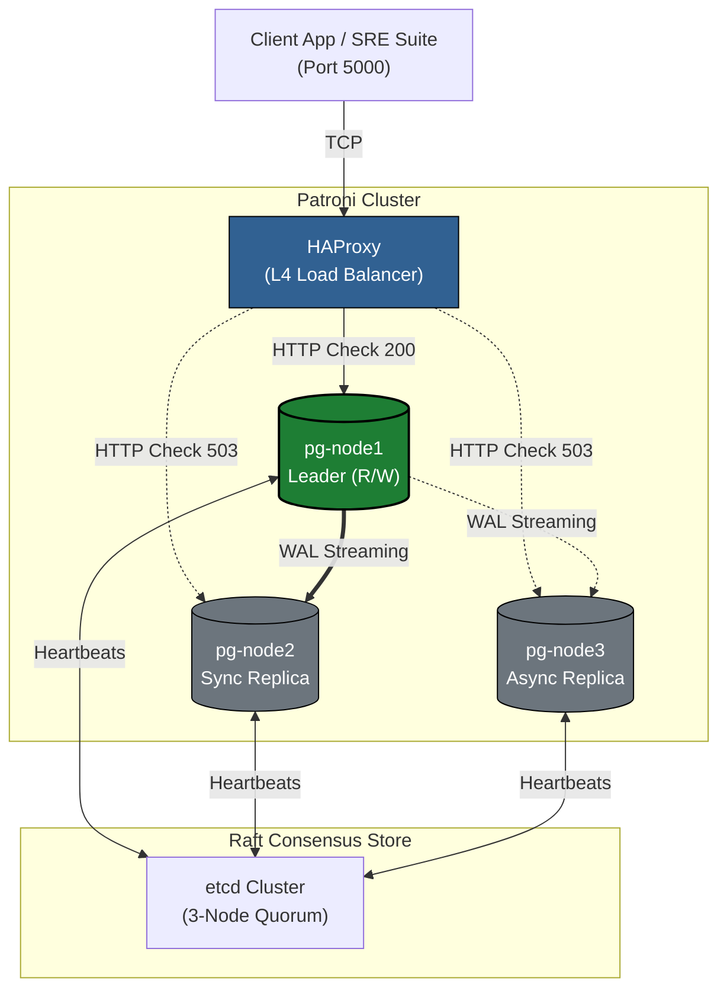

# **PostgreSQL High-Availability & Chaos Engineering Lab**

       

An open-source, fully reproducible Tier-1 Database Reliability laboratory demonstrating **Zero Data Loss (RPO = 0)** and **Sub-30s Automated Failover (RTO)** using CP-Distributed Consensus.

## **Summary**

In distributed stateful systems, high availability is not about preventing failures; it is about engineering automated, predictable survivability. Standard primary-replica database setups suffer from **Split-Brain** scenarios during network partitions.  

This project implements a strict **CP (Consistency / Partition Tolerance)** PostgreSQL cluster. Using **Patroni** as the initialization and failover controller, the database lifecycle is delegated to an **etcd** consensus malha based on the **Raft algorithm**. If a primary node loses network quorum, it voluntarily locks down its storage engine to guarantee absolute data integrity.

## **Architecture & Topology**



### **The Stack:**

* **Storage Engine:** PostgreSQL 16 (Debian Bookworm base)  
* **Cluster Controller / PID 1:** Patroni v3.3  
* **Distributed Consensus Store (DCS):** CNCF etcd v3.5 (CoreOS upstream)  
* **Static Entrypoint Gateway:** HAProxy v2.8 (Layer 4 TCP mode)  
* **Acceptance Suite:** Python 3 (psycopg2)

## **Repository Structure**

```Plaintext
├── test-scripts/  
│   ├── chaos_suite.py       # SRE Multithreaded chaos injector & audit suite  
│   └── client.py            # Simple continuous transaction logger  
├── docker-compose.yml       # 7-Service deterministic subnet orchestration  
├── Dockerfile               # Non-root custom PostgreSQL + Python3 + Patroni build  
├── haproxy.cfg              # L4 TCP pass-through & L7 Patroni REST checks  
└── patroni.yml              # Cluster bootstrap, DCS TTLs, and pg_hba rules
```

## **Quickstart: Local Reproduction**

### **1. Boot the Cluster**

Ensure Docker is running, then clone and spin up the deterministic subnet:

```Bash  
git clone https://github.com/KevenGustavo/postgres-ha-auto-failover-lab.git  
cd postgres-ha-auto-failover-lab

docker compose up -d --build
```

### **2. Inspect the Static Gateway**

Open your browser and navigate to the live HAProxy visualizer:

* **URL:** [http://localhost:8404](http://localhost:8404)  
  *(Notice that only the active Primary Leader is marked in bright green; Replicas are kept safely marked down to prevent accidental rogue writes).*

### **3. Verify Live Consensus Topology**

Execute Patroni's native cluster monitor inside any database node:

```Bash  
docker exec -it pg-node1 patronictl -c /etc/patroni/patroni.yml list
```

```Plaintext
+ Cluster: postgres-ha (7653933408267890720) -------+----+-----------+  
| Member   | Host        | Role         | State     | TL | Lag in MB |  
+----------+-------------+--------------+-----------+----+-----------+  
| pg-node1 | 172.20.0.21 | Leader       | running   |  1 |           |  
| pg-node2 | 172.20.0.22 | Sync Standby | streaming |  1 |         0 |  
| pg-node3 | 172.20.0.23 | Replica      | streaming |  1 |         0 |  
+----------+-------------+--------------+-----------+----+-----------+
```

## **Uncompromising SRE Chaos Audit**

To certify the high-availability claims, run the automated **SRE Acceptance Suite**.  
This multithreaded script spawns a background worker injecting continuous financial ledgers into the gateway while the main thread forcefully executes a physical docker kill on the active leader. 

It calculates the True Hardware Downtime (**RTO**), resurrects the dead node, triggers a pg_rewind self-healing process, and runs a mathematical audit across the disk volumes.

### **Install the PostgreSQL python driver in your local environment**

```bash
pip install psycopg2-binary
```

### **Run the unassisted SRE Showcase**

```bash  
python test-scripts/chaos_suite.py
```

#### **Certified Audit Output:**

```bash  
===============================================================================================  
EXECUTIVE SRE MATHEMATICAL AUDIT REPORT  
===============================================================================================  
 [GATEWAY METRICS]  
  • Primary Target Assassinated : pg-node3 (172.20.0.23)  
  • Cluster Failover RTO        : 26.08 seconds  
  • Network Timeouts Caught     : 111 transactions (Safely buffered by Client Backoff)

 [DATA INTEGRITY METRICS (RPO)]  
  • App Confirmed Writes        : 298 rows  
  • Storage Physical Rows       : 298 rows  
  • Absolute Cluster RPO        : 0 rows lost [PERFECT INTEGRITY]

 [ORPHAN REPLICATION RECONCILIATION]  
  • Orphan Window App Writes    : 56 rows generated while pg-node3 was DEAD  
  • Replicated to Resurrected   : 56 rows physically verified in pg-node3 disk  
===============================================================================================  
[CERTIFIED] High Availability and Self-Healing Acceptance test PASSED.
```

## **Architectural Decisions**

### **1. Why 3 Nodes instead of 2?**

To survive network partitions without human intervention, a distributed consensus engine requires a strict **Quorum**, defined mathematically as:

$$
Q = \lfloor \frac{N}{2} \rfloor + 1
$$  

In a 2-node cluster, a single failure leaves the surviving node with a count of 1 (lacking majority Quorum), forcing the cluster into a read-only lock to avoid Split-Brain. A 3-node cluster allows 1 complete physical node failure while maintaining a healthy, functional Quorum of 2.

### **2. Why HAProxy over PgBouncer?**

They solve entirely different problems. **HAProxy** is our *Optical Nerve* (Layer 4 TCP routing coupled with Layer 7 HTTP health checks against Patroni's /primary endpoint). **PgBouncer** is a *Connection Pooler* designed to protect PostgreSQL's RAM from connection exhaustion; it is completely blind to failover states. In a true Tier-1 Enterprise setup, PgBouncer sits *behind* HAProxy.

### **3. Why quay.io/coreos/etcd?**

Following Broadcom's public deprecation of free Docker Hub Bitnami container wrappers in late 2025, this project migrated the consensus layer directly to the official CNCF/RedHat upstream registry. We utilize pure Go binaries and native flags to minimize our CVE attack surface.

## **Author**

**Keven Gomes**  
[Connect on LinkedIn](https://www.linkedin.com/in/keven-gomes/) | [GitHub Profile](https://github.com/KevenGustavo)